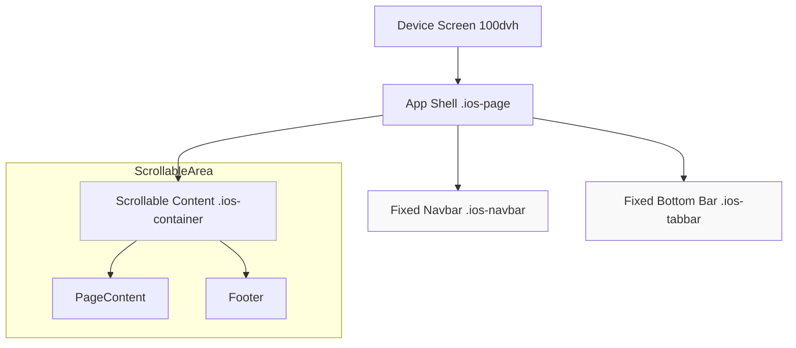

# AppHub Frontend Architecture

## 1. App Shell Strategy

We use Next.js **Route Groups** to implement distinct "App Shells" for different sections of the application, ensuring a persistent, mobile-app-like experience.

### Directory Structure

```text
app/
├── (website)/          # Public Website Route Group
│   ├── layout.tsx      # Website Shell (Nav + TabBar)
│   ├── page.tsx        # Homepage
│   ├── apps/           # Apps listing
│   └── category/       # Category filtering
├── admin/              # Admin Panel
│   ├── layout.tsx      # Admin Shell (Admin Nav)
│   ├── dashboard/      # Admin Menu
│   └── profile/        # Admin Profile
└── layout.tsx          # Root Layout (HTML/CSS only)
```

## 2. Shells

### A. Root Shell (`app/layout.tsx`)

- **Responsibility:** Global CSS, Fonts, Metadata, SEO/JSON-LD.
- **Content:** `<html><body>...</body></html>`

### B. Website Shell (`app/(website)/layout.tsx`)

- **Target:** Public users.
- **Components:**
  - Fast Transitions (CSS).
  - `<NavigationBar />`: Sticky, Glassmorphism.
  - `<BottomTabBar />`: iOS Standard Mobile Navigation.

### C. Admin Shell (`app/admin/layout.tsx`)

- **Target:** Administrators.
- **Components:**
  - Admin-specific Navigation Bar (Title: "Panel", Right: "Account").
  - Secure Context.

## 3. Viewport & Layout Strategy (Native Feel)

To mimic a native app, we lock the `<body>` and scroll an internal container.

### Global Rules (`globals.css`)

- **Body Lock:** `html, body { height: 100dvh; overflow: hidden; position: fixed; }`
  - Prevents "bounce" of the whole page.
  - Ensures app fits the physical screen exactly.
- **Flex Layout:** `.ios-page { display: flex; flex-direction: column; height: 100%; }`
- **Internal Scroll:** `.ios-container { flex: 1; overflow-y: auto; }`
  - Only this container scrolls.
  - Navbar and TabBar remain static/fixed.

### Layers

1. **Background:** `.secondary-system-background`
2. **Content:** Scrolled behind bars.
3. **Bars:** `z-index: 1000`. Glassmorphsim (Blur) allows content to be seen underneath.

### Safe Areas

We respect `env(safe-area-inset-*)` for passing notches and home indicators.

- **Top:** `padding-top` on Navbar.
- **Bottom:** `padding-bottom` on TabBar and Content Container.

## 4. Visual Architecture Diagram


