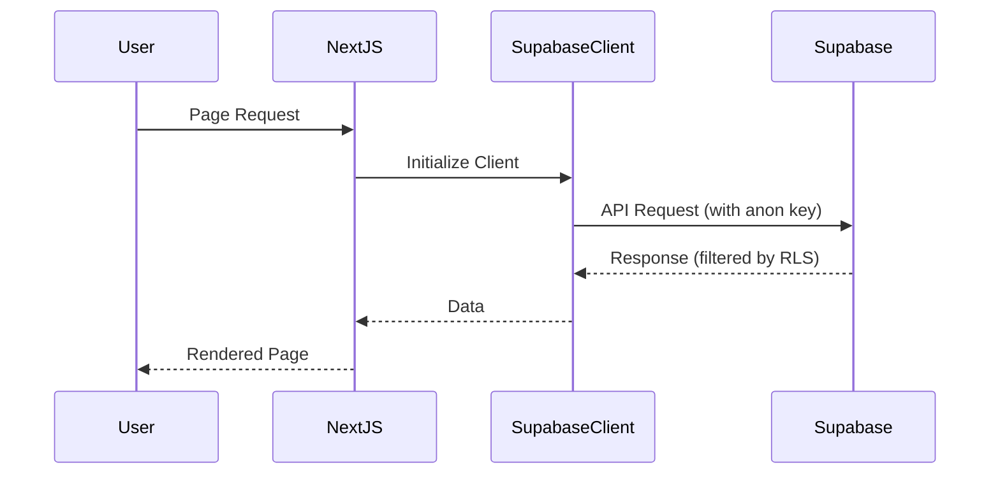
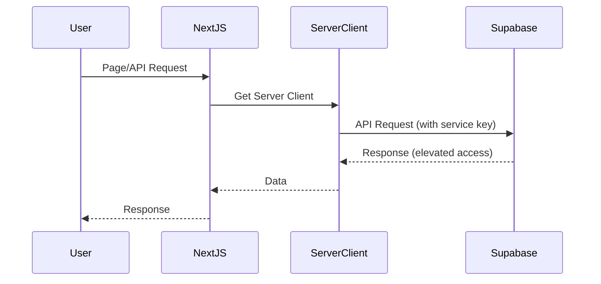
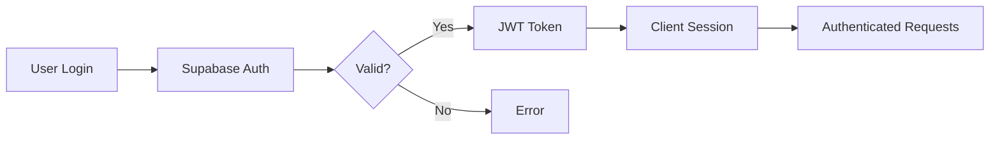
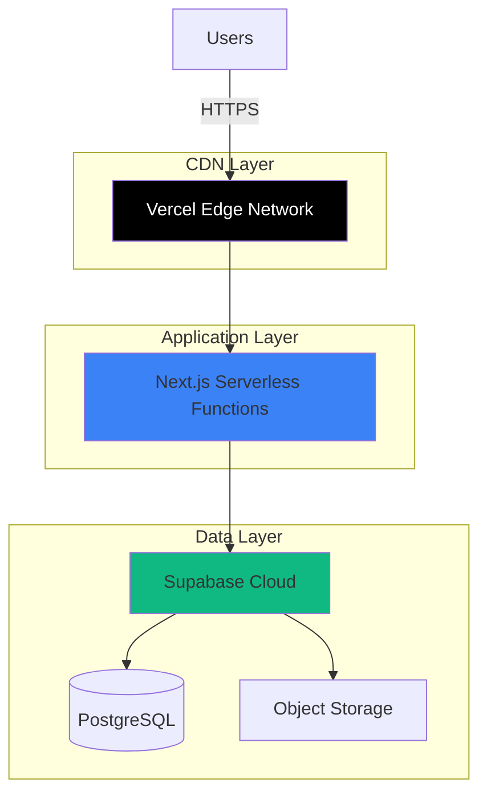

# AppHub Architecture

## System Overview

AppHub is a production-grade web platform built on a modern stack designed for scalability, security, and maintainability.

```mermaid
graph TB
    subgraph "Frontend Layer"
        Web[Next.js App<br/>SSR + App Router]
    end
    
    subgraph "Shared Packages"
        DB[@apphub/db<br/>Supabase Client]
        Config[@apphub/config<br/>Environment & Constants]
    end
    
    subgraph "Backend Services"
        Supabase[Supabase Platform]
        PostgreSQL[(PostgreSQL<br/>Database)]
        Auth[Supabase Auth]
        Storage[Supabase Storage]
        API[Auto-generated API]
    end
    
    Web --> DB
    Web --> Config
    DB --> Supabase
    Supabase --> PostgreSQL
    Supabase --> Auth
    Supabase --> Storage
    Supabase --> API
    
    style Web fill:#3b82f6
    style DB fill:#8b5cf6
    style Config fill:#8b5cf6
    style Supabase fill:#10b981
```

## Technology Stack

### Frontend

- **Next.js 14+**: React framework with App Router and SSR
- **TypeScript**: Type-safe development
- **React 18**: Modern React with concurrent features

### Backend

- **Supabase**: Backend-as-a-Service platform
  - PostgreSQL database with auto-generated API
  - Built-in authentication
  - File storage with CDN
  - Real-time subscriptions (ready for future use)
  - Row Level Security (RLS) for data protection

### Development Tools

- **pnpm**: Fast, efficient package manager with workspace support
- **ESLint**: Code quality and consistency
- **Prettier**: Code formatting
- **TypeScript Compiler**: Strict type checking

## Monorepo Structure

### Apps

- `apps/web`: Next.js frontend application
  - Server-side rendering for SEO and performance
  - App Router for modern routing patterns
  - Custom error pages (404, 500)
  - TypeScript for type safety

### Packages

- `packages/db`: Supabase client and database types
  - Browser client for client-side operations
  - Server client for privileged operations
  - Auto-generated TypeScript types from schema
  
- `packages/config`: Shared configuration
  - Environment variable validation
  - Application constants
  - Type-safe configuration access

## Data Flow

### Client-Side Requests



### Server-Side Requests (SSR/API Routes)



## Security Architecture

### Defense in Depth

1. **Environment Isolation**: Separate keys for client/server operations
2. **Row Level Security**: Database-level access control
3. **Type Safety**: TypeScript prevents runtime errors
4. **Input Validation**: Zod schemas for runtime validation (future)
5. **Security Headers**: CSP, HSTS, X-Frame-Options, etc.

### Authentication Flow (Future)



## Deployment Architecture (Future)



## Observability & Monitoring (Future)

Following operational spec requirements:

- Structured logging (JSON format)
- OpenTelemetry for distributed tracing
- Prometheus-compatible metrics
- Health check endpoints
- Error tracking and alerting

## Scalability Considerations

1. **Horizontal Scaling**: Vercel auto-scales Next.js instances
2. **Database**: Supabase handles connection pooling and replication
3. **Static Assets**: CDN caching for optimal performance
4. **API Caching**: Next.js built-in caching strategies
5. **Edge Functions**: Deploy compute closer to users (future)

## Security Compliance

Aligned with operational spec rules:

- ✅ All secrets in environment variables
- ✅ Never commit credentials
- ✅ Least-privilege access patterns
- ✅ Encrypted data at rest and in transit
- ✅ Prepared for audit logging
- ✅ Security headers configured

---

**Status**: Foundation architecture complete and ready for feature implementation
