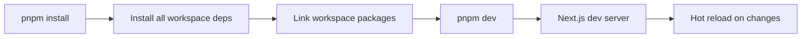

# AppHub Project Structure

## Overview

AppHub follows a monorepo architecture using pnpm workspaces, separating concerns between frontend applications and shared packages.

## Directory Structure

```
AppHub/
├── .gitignore              # Git ignore patterns
├── .prettierrc             # Prettier configuration
├── .prettierignore         # Prettier ignore patterns
├── .eslintrc.json          # ESLint configuration
├── .env.example            # Environment variable template
├── pnpm-workspace.yaml     # Workspace configuration
├── package.json            # Root package with scripts
├── tsconfig.json           # Base TypeScript config
├── README.md               # Project documentation
│
├── apps/                   # Application layer
│   └── web/                # Next.js frontend
│       ├── app/            # Next.js App Router
│       │   ├── layout.tsx  # Root layout component
│       │   ├── page.tsx    # Homepage (/)
│       │   ├── error.tsx   # Error boundary (500)
│       │   ├── not-found.tsx # 404 page
│       │   └── globals.css # Global styles
│       ├── next.config.js  # Next.js configuration
│       ├── tsconfig.json   # Next.js TypeScript config
│       └── package.json    # Next.js dependencies
│
├── packages/               # Shared packages
│   ├── db/                 # Database client
│   │   ├── src/
│   │   │   ├── client.ts   # Supabase client setup
│   │   │   ├── types.ts    # Database type definitions
│   │   │   └── index.ts    # Package exports
│   │   ├── package.json
│   │   └── tsconfig.json
│   │
│   └── config/             # Configuration package
│       ├── src/
│       │   ├── env.ts      # Environment validation
│       │   ├── constants.ts # App constants
│       │   └── index.ts    # Package exports
│       ├── package.json
│       └── tsconfig.json
│
└── docs/                   # Documentation
    ├── architecture.md     # System architecture
    ├── project-structure.md # This file
    ├── setup-guide.md      # Setup instructions
    └── supabase-setup.md   # Supabase configuration
```

## Package Responsibilities

### `apps/web` - Next.js Frontend

**Purpose**: User-facing web application

**Key Features**:

- Server-side rendering (SSR) for SEO and performance
- App Router for modern file-based routing
- TypeScript for type safety
- Custom error pages for better UX
- Consumes shared packages

**Dependencies**:

- `next`, `react`, `react-dom` - Core framework
- `@apphub/db` - Database client (workspace)
- `@apphub/config` - Shared config (workspace)

**Pages**:

- `/` - Homepage
- `/404` - Custom not found page
- `/error` - Global error boundary

### `packages/db` - Supabase Client

**Purpose**: Centralized database access layer

**Key Features**:

- Supabase client initialization
- Type-safe database operations
- Separate browser/server clients
- Auto-generated TypeScript types

**Exports**:

```typescript
import { supabase, getServerSupabaseClient, Database } from '@apphub/db';
```

**Usage**:

- Browser operations: Use `supabase` client
- Server operations: Use `getServerSupabaseClient()`
- Type definitions: Import `Database` type

### `packages/config` - Configuration

**Purpose**: Shared configuration and constants

**Key Features**:

- Environment variable validation
- Type-safe environment access
- Application-wide constants
- Upload limits and security config

**Exports**:

```typescript
import { env, validateEnv, APP_NAME, UPLOAD_LIMITS } from '@apphub/config';
```

**Constants**:

- `APP_NAME`, `APP_DESCRIPTION`
- `UPLOAD_LIMITS` - File upload configuration
- `URLS` - Route constants
- `STORAGE` - Storage configuration
- `SECURITY_HEADERS` - Security policies

## Configuration Files

### Root Level

- **`.gitignore`**: Excludes `node_modules`, build outputs, env files
- **`.eslintrc.json`**: ESLint rules for TypeScript
- **`.prettierrc`**: Code formatting standards
- **`tsconfig.json`**: Base TypeScript configuration
- **`pnpm-workspace.yaml`**: Defines workspace packages

### Package Level

Each package has:

- **`package.json`**: Dependencies and scripts
- **`tsconfig.json`**: TypeScript configuration extending root

## Workspace Dependencies

```mermaid
graph TD
    Root[Root Workspace]
    Web[apps/web]
    DB[packages/db]
    Config[packages/config]
    
    Root --> Web
    Root --> DB
    Root --> Config
    Web --> DB
    Web --> Config
    
    style Root fill:#1f2937
    style Web fill:#3b82f6
    style DB fill:#8b5cf6
    style Config fill:#8b5cf6
```



## Build & Development Flow



## File Naming Conventions

- **React Components**: PascalCase, `.tsx` extension
- **TypeScript Files**: camelCase, `.ts` extension
- **Config Files**: kebab-case (e.g., `next.config.js`)
- **Documentation**: kebab-case (e.g., `setup-guide.md`)

## Import Paths

### Workspace Packages

```typescript
// In apps/web
import { supabase } from '@apphub/db';
import { env } from '@apphub/config';
```

### Relative Imports (within same package)

```typescript
// In apps/web
import { Component } from './components/Component';
import { utils } from '@/utils'; // Using path alias
```

## Adding New Packages

1. Create directory in `packages/[name]`
2. Add `package.json` with workspace dependencies
3. Add `tsconfig.json` extending root config
4. Create `src/index.ts` as entry point
5. Update `pnpm-workspace.yaml` if needed (auto-discovered)
6. Run `pnpm install` to link

## Adding New Apps

1. Create directory in `apps/[name]`
2. Initialize application (e.g., `create-next-app`)
3. Reference workspace packages in `package.json`
4. Add build/dev scripts to root `package.json`
5. Run `pnpm install` to link

---

**Note**: This structure follows production-grade monorepo patterns and is designed for scalability as the project grows.
